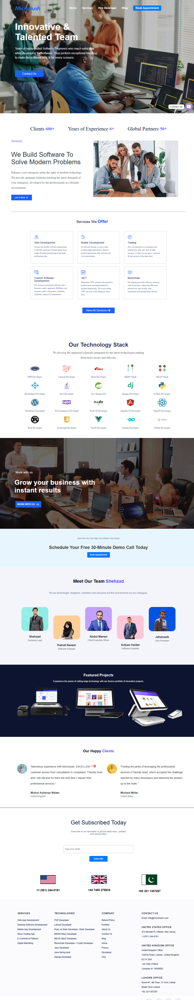

# Microslush Website Clone

A desktop-focused clone of the Microslush software development website built with vanilla HTML and CSS. The project recreates the original site's layout, navigation, services, technology stack, team, projects, testimonials, and footer.

## Table of Contents

- [Project Preview](#project-preview)
- [Live Demo](#live-demo)
- [Technologies Used](#technologies-used)
- [Features](#features)
- [Project Structure](#project-structure)
- [Key Files](#key-files)
- [Author](#author)
  
  
## Project Preview



## Live Demo

[View Live Demo](https://hadiashah01.github.io/microslush-layout-practice/)

> [!NOTE]
This version is currently focused on the desktop layout. Responsive breakpoints may be added in a future iteration.»

## Technologies Used

- HTML5
- CSS3
- Flexbox
- SVG

## Features

- Desktop-focused layout
- Navigation with dropdown menus
- Hero and CTA sections
- Services and technology sections
- Team and project showcases
- Testimonials
- Contact and footer sections
- Flexbox-based layout

## Project Structure

```text
├── assets/
├── index.html
├── style.css
└── README.md
```

## Key Files

- [HTML] (./index.html)
- [CSS] (./style.css)
  
## Author 
**Hadia Shahjahan**

Frontend Developer focused on building clean, responsive, and user-friendly web interfaces.  
GitHub: [@hadiashah01](https://github.com/hadiashah01).  
LinkedIn: [Hadia Shahjahan](https://www.linkedin.com/in/hadia-shahjahan)
